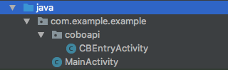

# CoboSDK-Android
CoboSDK帮助开发者通过[Cobo钱包](https://cobo.com/)进行ethereum交易的签名和发送。
DApp开发者可以使用CoboSDK获取用户的ethereum账户地址，完成消息的签名和校验，发起交易、调用智能合约以及广播签名后的交易数据。从而省去了开发者自行实现用户私钥管理和钱包功能的工作。

## 接入CoboSDK
接入CoboSDK需要如下几个步骤：
### 导入.AAR
clone或下载CoboSDK的repository后，在AndroidStudio的菜单中选择：File -> New -> New Module... -> Import .JAR/.AAR Package，选择下载的cobo-sdk.aar后点击完成。
### 添加依赖
打开```build.gradle```文件，在```dependencies```中添加：
```groovy
implementation project(':cobo-sdk')
implementation 'com.google.code.gson:gson:2.8.4'
implementation 'org.web3j:core:3.3.1-android'
```
### 初始化CoboSDK
调用CoboSDK的```initialize```方法对SDK进行初始化：
```java
CoboSDK.getInstance().initialize(this);
```
### 接收返回结果
 1. 添加`CBEntryActivity`

在你的应用package下新建一个名为`coboapi`的package，并在`coboapi`包下新建一个名为`CBEntryActivity`的Activity。
```

```
并在AndroidManifest.xml文件中为```CBEntryActivity```加上```android:exported="true"```和```android:launchMode="singleTask"```属性，例如：
```xml
<activity
    android:name=".coboapi.CBEntryActivity"
    android:exported="true"
    android:launchMode="singleTask" />
```

 2. 实现`CBEntryActivity`的`onCreate`方法
```java
@Override  
protected void onCreate(Bundle savedInstanceState) {
    super.onCreate(savedInstanceState);
    setContentView(R.layout.activity_cbentry);

    Intent intent = getIntent();
    CoboSDK.getInstance().handleIntent(intent);
    finish();
}
```
## 使用SDK
 - 签名消息
```java
final String message = "Hello Cobo!";
CoboSDK.getInstance().signMessage(message, new SignMessageAction.ResultHandler() {
    @Override
    public void onResult(SignMessageResult result) {
        Log.i("DEMO", "result: " + result.address);
        boolean match = CoboSDK.getInstance().verifyMessage(result.address, result.signature, message);
        Log.i("DEMO", "match: " + match);
    }

    @Override
    public void onError(int code, String message) {
        Log.e("DEMO", "error: " + code + " message: " + message);
    }
}, this);
```
 - 发送交易
```java
BigInteger gasPrice = new BigInteger("1000000000"); // 1 Gwei
BigInteger gasLimit = new BigInteger("21000");
BigInteger value = new BigInteger("1000000000000000000"); // 1 ETH
String from = <replace with address in sign message result>
String to = <replace with address to transfer to>
RawTransaction tx = RawTransaction.createTransaction(null, gasPrice, gasLimit, to, value, null);
CoboSDK.getInstance().sendTransaction(tx, from, new SignTransactionAction.ResultHandler() {
    @Override
    public void onResult(SignTransactionResult result) {
        Log.i("DEMO", "result: " + result.hash);
    }

    @Override
    public void onError(int code, String message) {
        Log.e("DEMO", "error: " + code + " message: " + message);
    }
}, this);
```
更多功能使用请参考```Example```工程。